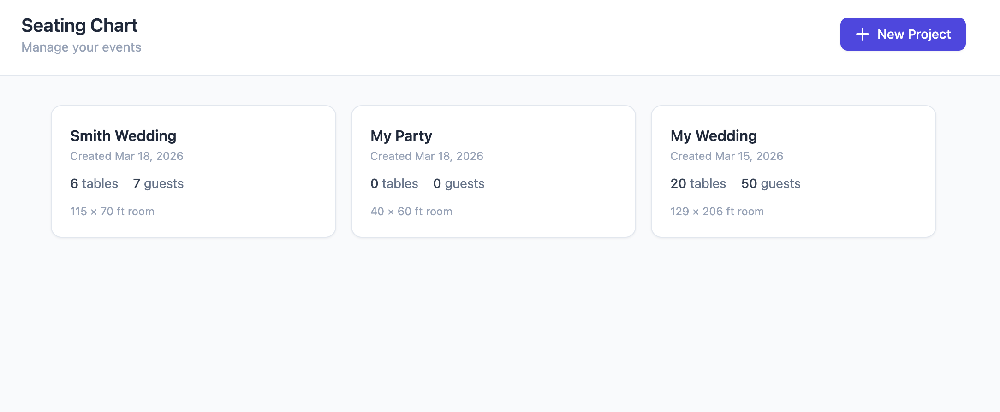
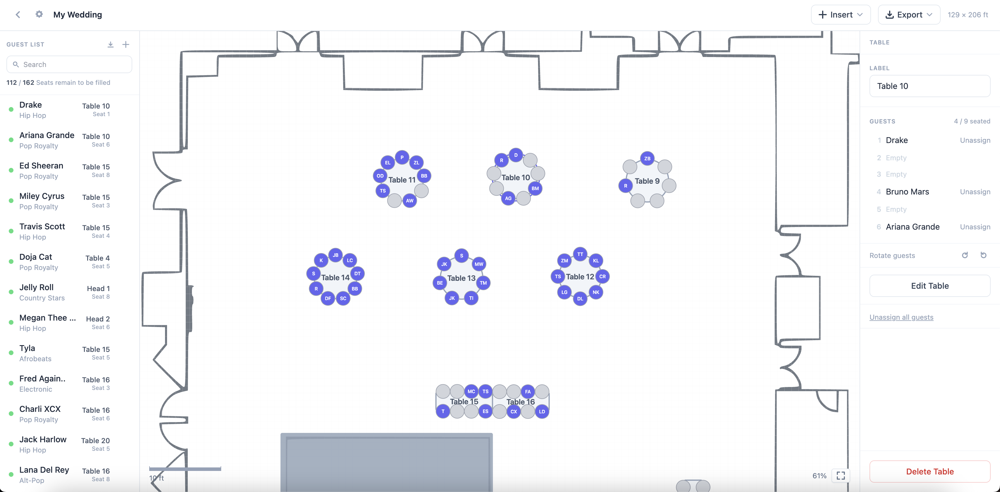
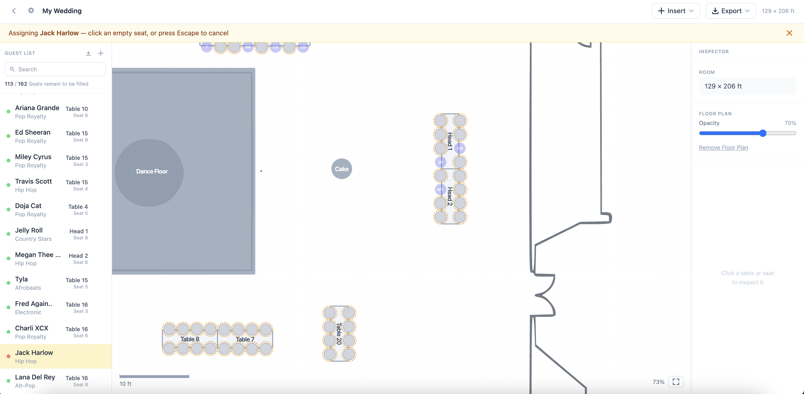
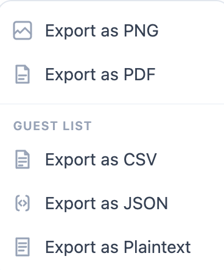

# Seating Chart

A browser-based event seating planner — drag tables onto a scaled floor plan, manage a guest list, assign seats, and export a finished chart. No account, no server, no data leaves your browser.



---

## Features

**Canvas**
- Zoomable, pannable SVG canvas with real-world scale (feet)
- Place round, rectangular, and square tables with configurable seat counts
- Drag tables to reposition; rotate with numeric input or by dragging the handle
- Import a floor plan image and trace it as an SVG overlay for accurate room layout
- Annotate the canvas with freeform shapes and text labels
- Visual warnings for tables placed outside room bounds or over capacity

**Guests**
- Add guests manually with group and dietary notes
- Add plus-one sub-guests linked to a parent guest
- Bulk-import from CSV (`name`, `group`, `notes` columns; automatic duplicate skipping)
- Search and filter the guest list in real time

**Seat Assignment**
- Click a guest to enter assignment mode → click any empty seat to assign
- Bulk-assign: select multiple guests to fill a table at once
- Rotate assigned guests around a table's seats in one click
- Click an assigned guest in the list to pan the canvas directly to their seat

**Export**
- PNG — high-resolution canvas snapshot
- PDF — A4/Letter document with project name and date header
- CSV / JSON — structured guest+seat data for mail merge or import elsewhere
- Plaintext — grouped by table, ready to print and post at the venue

**Projects**
- Multi-project dashboard; each project stores independently in the browser
- Rename, resize the room, or delete projects at any time

---

## Tech

| Layer | Choice |
|---|---|
| UI | React 19 + TypeScript |
| Build | Vite 7 |
| Routing | React Router 7 |
| State | Zustand |
| Persistence | Dexie (IndexedDB) |
| Styling | Tailwind CSS |
| Canvas | Custom SVG (no canvas library) |
| CSV | Papa Parse |
| Image tracing | Potrace WASM |
| Export | html2canvas + jsPDF |

All state lives in-memory via Zustand and is persisted to IndexedDB through Dexie. No backend, no auth, no network requests at runtime.

---

## Architecture notes

- **Real-world coordinate system** — tables and seats store positions in feet; a `pixelsPerFoot` scale factor converts to SVG pixels at render time, making all positions zoom-independent.
- **Screen-space fixed seat circles** — seat radius is computed as `SEAT_SCREEN_R / zoom` so circles stay the same visual size at any zoom level without adjusting the underlying data.
- **Discriminated union drag state** — a single `DragState` type (`none | pan | table | rotate`) prevents interaction conflicts and makes each phase of the drag lifecycle self-contained.
- **Immutable Zustand mutations** — every store action produces a new object tree; Zustand shallow-diffs and re-renders only what changed.
- **Atomic bulk assignment** — `bulkAssignGuests` diffs the previous and desired guest sets and flushes removes + adds in a single IndexedDB write.
- **Client-side floor plan tracing** — floor plan images are vectorized in-browser via a WASM build of Potrace, producing clean SVG paths that overlay the canvas at configurable opacity.

---

## Screenshots

| Dashboard | Canvas editor |
|---|---|
|  |  |

| Guest list & seat assignment | Export options |
|---|---|
|  |  |

---

## Getting started

```bash
npm install
npm run dev        # http://localhost:5173
```

```bash
npm run build      # production build → dist/
npm run preview    # preview the production build locally
```
